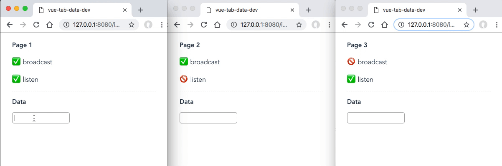

vue-tab-data
==============================

在同一个浏览器的不同标签页，响应式地共享数据。

### 效果



###  特性


- 可以在tab之间共享数据
- 使用mixin，将数据混入，可直接像修改data一样修改数据，将响应式更新到注册的标签页
- 提供广播、监听选项(均默认为true)
- 刷新页面仍保留数据
- 插件基于[localStorage](https://note.youdao.com/)和[StorageEvent](https://developer.mozilla.org/en-US/docs/Web/API/StorageEvent)
- 建议在组件使用，不建议使用全局注入，[详见>>](https://cn.vuejs.org/v2/guide/mixins.html#%E5%85%A8%E5%B1%80%E6%B7%B7%E5%85%A5)
- 无依赖，打包后仅2kb

### 安装

使用 npm 安装：

```
npm install vue-tab-data
```

## 用法
```javascript
/* 
    调用vueTabData以生成一个mixin
    第一个参数为需要注册的data
    第二个参数为是否需要广播
    第三个参数为是否需要监听
*/
mixin = vueTabData(data, broadcast, listen)
```
## 例子
```javascript
import vueTabData from 'vue-tab-data'
//会更新到注册监听的标签页，但别的页面更改不会影响这里
export default {
    name: 'App',
    mixins: [vueTabData({
        mydata: null
    }, true, false)],
    methods: {
        change () {
            this.mydata = 'my setting'
        }
    }
}
```

## 开源协议

MIT
